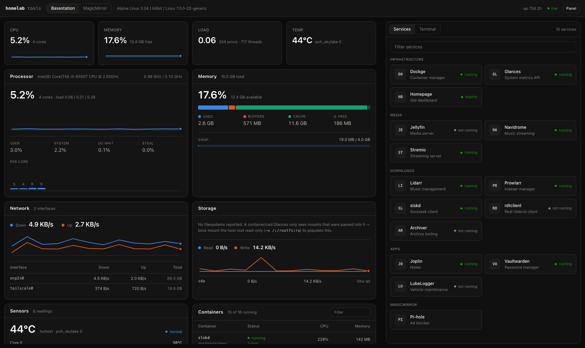

# helm

A single page for running a homelab: live metrics from [Glances](https://nicolargo.github.io/glances/)
across any number of nodes, a launcher for your services, and a terminal.

It replaces a Homepage instance and a `ssh` window with one thing you can pin to
a phone home screen.



## What it does

- **Metrics** — CPU (total, per core, and the user/system/iowait split), memory
  composition, swap, load, network throughput, disk I/O, filesystems, sensors,
  containers and processes. Sparklines keep 60 samples of history per node.
- **Alerts** — pushed to your phone through [ntfy](https://ntfy.sh) when
  something actually breaks, so you find out without opening anything.
- **Container control** — restart, stop, start and tail logs from the phone,
  for the node this server runs on. Destructive actions confirm first.
- **Apps** — a home-screen style launcher for everything you run, with each
  app's real icon. An app that names its container shows only while that
  container is running; stopped ones are counted and left to the Containers
  page, which is where you'd start them. Mark a few `"favorite": true` and they
  sit at the top of the home page. Icons come from
  [dashboard-icons](https://github.com/homarr-labs/dashboard-icons) and are
  fetched once by the server and cached on disk, so the browser never talks to a
  CDN.
- **Terminal** — a real PTY over a WebSocket, with full job control (`Ctrl+C`,
  `Ctrl+Z`, `fg`/`bg`) and a configurable command palette. Runs as *you*, not
  root — so rootless `podman` works against your own socket, and `sudo` covers
  the rest. On touch devices it grows a key bar for the things a phone keyboard
  has no key for: Ctrl, Esc, Tab, arrows, `^C`/`^Z`/`^D`.
- **Multi-node** — every node in `config.json` gets a card on the home page,
  which leads with anything that needs attention (a crash-looping container, a
  disk past the alert threshold, a sensor at its limit). Nothing is hard-coded;
  point it at one machine or twelve.
- **Mobile first** — four pages (Machines, Apps, Containers, Terminal) behind a
  bottom tab bar on a phone and a top nav on a wider screen, in light or dark
  following the device setting.

## Quick start

```sh
bun install
cp config.example.json config.json   # edit: your nodes, services, commands
bun dev                              # API on :3001, UI on :5173
```

`bun dev` runs the Bun server and Vite together; Vite proxies `/api` and `/pty`
to the server, so development and production behave identically.

For a production run on this machine:

```sh
bun run build
bun start          # serves the built UI, the API and the PTY on :3001
```

## Installing on a server

`dist/` is committed, so the repo *is* the build. Clone it on the box and run
the installer once:

```sh
git clone <this repo> ~/helm
cd ~/helm
sudo ./install.sh
```

Nothing is compiled and nothing is copied — the systemd unit runs the server
straight out of the checkout. Updating is therefore just:

```sh
git -C ~/helm pull && sudo systemctl restart helm
```

```sh
sudo ./install.sh --port 3001
sudo ./install.sh --host 100.x.y.z   # pin an address instead of resolving one
sudo ./install.sh --no-tailscale     # no Tailscale: bind 127.0.0.1 (or pass --host)
sudo ./install.sh --uninstall        # removes the unit, keeps config + checkout
```

### Tailnet only

The terminal is a real shell on the box, so the service binds to this machine's Tailscale
address and nothing else. Not the LAN, not `0.0.0.0`. From any device on your
tailnet `http://<host>:3001` just works; from anywhere else the port is not
listening at all.

The address is resolved on every start by `bin/tailnet-env.sh`, which systemd
runs as `ExecStartPre`, rather than being frozen in at install time — so a boot
that gets ahead of `tailscaled` waits for it, and a changed tailnet IP is picked
up without reinstalling. If Tailscale never comes up the unit fails; it does not
fall back to a wider bind.

There is no access token by default: the tailnet is the boundary. To add one as
a second layer, put a string in `auth.token` in the config below and restart —
the server will then require it as `?token=…` or an `X-Helm-Token` header.

### Config and logs

Runtime config lives at `/etc/helm/config.json` (mode 600), seeded from
`config.example.json` on first install and left alone by every install after
that. It is deliberately outside the repo, since `config.json` is gitignored and
may hold Glances credentials.

```sh
journalctl -u helm -f
```

### Add to an iPhone home screen

Open the URL in Safari over your tailnet → Share → **Add to Home Screen**. It
launches standalone with no browser chrome and respects the notch and home
indicator.

## Configuration

Resolution order: `$HELM_CONFIG`, then `./config.json`, then
`~/.config/helm/config.json`, then `/etc/helm/config.json`. See `config.example.json` for the full shape.

```jsonc
{
  "server":   { "host": "127.0.0.1", "port": 3001 },
  "auth":     { "token": null },            // required on every request when set
  "terminal": { "enabled": true, "shell": null, "args": [], "cwd": null },
  "refreshMs": 5000,

  "nodes": [
    { "id": "server", "label": "Server",
      "url": "http://server:61208", "api": 4 }
  ],

  "services": [
    { "group": "Media", "name": "Jellyfin", "url": "http://server:8096",
      "description": "Media server",
      "container": "jellyfin",              // shown in Apps only while this runs
      "node": "server",                     // which machine that container is on
      "icon": "jellyfin",                   // dashboard-icons slug; defaults to the
                                            // name, 1–2 characters = initials
      "favorite": true }                    // pinned to the top of the home page
  ],

  "commands": [
    { "name": "restart-tailscale", "description": "...",
      "command": "sudo systemctl restart tailscaled" }
  ]
}
```

Any field can be overridden by environment (what the systemd unit uses):
`HELM_CONFIG`, `HELM_HOST`, `HELM_PORT`, `HELM_TOKEN`, `HELM_SHELL`,
`HELM_REFRESH_MS`, `HELM_NODES` (`label=url,label=url`).

Pages are real paths, so they can be bookmarked or linked from a notification:
`/machines/laptop`, `/apps`, `/containers?node=laptop&show=stopped`, `/terminal`.
Old `/?node=…&tab=terminal` links still land on the right page.

## Staying cheap

The machines being watched matter more than this dashboard, so the polling was
measured rather than assumed. Against Glances 4.5.6 on an i5-6500T:

| approach | Glances CPU | wire |
|---|---|---|
| `/api/4/all` every 3s | ~6.5% of a core | ~96 KB/s |
| what this does, 5s | **~1.5% of a core** | **~1.1 KB/s** |

How:

- **Never `/all`.** It recomputes every plugin including the process list
  (~194ms, 288 KB) each tick. Only the plugins actually on screen are fetched.
- **Per-plugin TTLs.** CPU, memory, load, network and disk refresh every tick;
  containers and process counts every 15s; sensors 30s; filesystems 60s; the
  OS name once. Steady state is six small requests, not thirteen.
- **Sequential, never parallel.** Glances derives percentages from deltas
  against its own last sample, and concurrent plugin requests race for that
  state — `cpu` and `quicklook` fired together will report 0% and 100% for the
  same instant.
- **The process list is opt-in.** It is the single most expensive plugin
  (~89ms, 176 KB), so that panel is collapsed by default and only polled while
  open — and then via `processlist/top/20`, which is 13 KB.
- **Viewers are coalesced.** Four browser tabs cost the node the same as one.
- **Nothing polls on a timer** *unless alerts are on*. No browser open means no
  requests at all, and a hidden tab stops polling. Alerts add one sweep a
  minute — roughly 0.15% of a core, against ~1.5% while the dashboard is open.

On the machine running it: **no runtime dependencies** — the server imports only
Bun built-ins, so an install is `dist/` plus `server/` and no `node_modules`.
The dashboard is 38 KB gzipped; xterm is a separate 83 KB chunk that only loads
if you open the terminal. The unit runs at `Nice=5` with idle-ish I/O priority
and a 512 MB ceiling as a bug tripwire.

## Alerts

The one thing here that polls on its own. Everything else happens because a
browser asked — but an alert you only see when you open the dashboard is
useless, since you open the dashboard when you already know something is wrong.

```jsonc
"alerts": {
  "enabled": true,
  "url": "https://ntfy.example.com",
  "topic": "helm-alerts",
  "token": null,              // inline token, if the topic is protected
  "tokenFile": "/home/you/.config/ntfy-token",  // ...or read it from here
  "clickUrl": "http://server:3001/",   // where tapping it takes you
  "intervalMs": 60000,        // vs the dashboard's 5s
  "sustain": 3,               // consecutive checks before it fires
  "repeatMs": 0,              // 0 = tell me once; >0 re-notifies on that interval
  "notifyRecovery": true,
  "rules": {
    "cpu": null, "mem": null, "swap": null, "loadPerCore": null,
    "fs": 90, "temperature": true, "containerCrashed": true, "nodeDown": true
  }
}
```

**The utilisation rules ship disabled on purpose.** A homelab spikes CPU, memory
and disk all day — backups, transcodes, library scans — and an alert you learn
to swipe away is worse than no alert at all. What is enabled is the set you
would actually get up and fix:

| rule | fires when | priority |
|---|---|---|
| `nodeDown` | Glances is unreachable | 5 (max) |
| `temperature` | a sensor hits its **critical** point, not its warning point | 5 |
| `containerCrashed` | a container is `restarting` or `dead` — **not** one you stopped | 4 |
| `fs` | a filesystem is ≥ 90% full | 4 |

Set `"cpu": 90` (etc.) if you decide you do want them.

Three things keep it from becoming noise:

- A condition must hold for `sustain` consecutive checks before firing (≈3
  minutes, so a reboot doesn't page you).
- It fires on the transition and then stays quiet. With `repeatMs: 0` that
  means **once** — it will not speak again about the same thing until the
  condition clears and returns.
- **A container you stop is never an alert.** Every stack here uses
  `restart: always`, and that policy is not applied to a manual stop — so a
  container sitting in `exited` was stopped deliberately, while one that is
  `restarting` or `dead` failed on its own. Only the latter fires. Exit codes
  are no help: podman reports `-1` for most stopped containers.

If the topic requires auth, set either `token` or `tokenFile`. `tokenFile`
keeps the secret out of a config file and lets `scripts/git-check` share the
same copy; a missing or empty file warns at startup rather than turning into a
silent 403 on every alert. `token` wins if both are set.

Verify delivery end to end without waiting for a real failure:

```sh
curl -X POST http://server:3001/api/alerts/test    # sends one notification
curl -X POST http://server:3001/api/alerts/sweep   # runs a real evaluation now
```

## Stacks

Compose stacks, listed from the same directory Dockge is pointed at, so the two
agree on what exists without sharing any state.

```jsonc
"stacks": {
  "enabled": true,
  "dir": "/home/you/stacks",
  "command": ["podman", "compose"]
}
```

`up` / `restart` / `down` / `edit` / `delete`, plus creating a stack from
scratch. Commands run in the stack's own directory using exactly what you would
type by hand — `podman compose`, not `podman-compose` — so the result is the
same. The provider banner podman prints every run is stripped from the output.

**Commands run as jobs, streamed over a WebSocket.** `up` can pull images for
minutes, which would time out a plain request and show nothing until it
finished. The job outlives the connection, so locking your phone mid-pull does
not kill the pull, and reconnecting replays the whole run rather than the tail.
One job per stack at a time.

**Editing** is two textareas — `compose.yaml` and `.env` — with Tab inserting
spaces and iOS autocapitalise turned off, because YAML is indentation-sensitive
and `Services:` is not `services:`. Saving **validates by running `compose
config` against a throwaway copy**, so a bad file never reaches the real
directory; that catches invalid compose as well as invalid YAML, and needs no
YAML dependency. The previous version is kept as `compose.yaml.bak` / `.env.bak`.

**Creating** writes `compose.yaml` and `.env` together, matching what Dockge
leaves behind.

**Deleting is total** — `compose down -v` then the whole directory, data
included. Stopping is how you keep an inactive stack around; deleting means it
should be gone. Stack names are validated and resolved against the stacks
directory before anything is removed.

Containers are matched to stacks through the
`com.docker.compose.project.working_dir` label rather than by name, because
Dockge's own stack lives outside the stacks directory and would otherwise be
mislabelled. A directory counts as a stack if it holds `compose.yaml`,
`compose.yml`, `docker-compose.yml` or `docker-compose.yaml`; anything else is
skipped. Stopped stacks are listed like any other — they are the archive of
things to come back to, not failures.

Local node only, same as container actions.

## Container actions

Glances is read-only, so acting on a container means running `podman`/`docker`
locally — there is no remote path. Actions are therefore offered **only for the
node this server runs on**, detected by matching its Glances hostname against
our own (no configuration needed; set `"local": true/false` on a node to
override). Other nodes stay read-only, and the UI hides the buttons rather than
offering something that would fail.

This crosses no privilege boundary the app did not already have — the terminal
is a full shell as the same user. It does mean the server executes commands, so:
every call is argv-only and never a shell string; the container name is checked
against the live list before use; actions are POST-only; and `stop`/`restart`
ask for confirmation. Set `"containers": { "enabled": false }` to make the
dashboard strictly read-only.

## Notes

- **Sparkline backfill is best-effort.** Glances records history only when
  something polls it, so the series is not evenly spaced — a real node showed
  177 points across three days with a 46-hour gap where nobody was watching.
  The backfill therefore uses only the most recent unbroken run and otherwise
  fills nothing. In practice it covers reloads and tab switches, not a cold
  open after hours away, because in that case Glances has no recent history to
  give.
- **The PTY must be spawned with `terminal: {...}` options, not a prebuilt
  `new Bun.Terminal(...)`.** Only on Bun's own spawn path does it call
  `setsid()` for the pty, making the shell a session leader that owns the
  terminal. Pass an instance instead and the shell starts with "cannot set
  terminal process group / no job control" — and `Ctrl+C` cannot interrupt
  anything.

- **Filesystems need a mount.** A containerized Glances only sees what was
  passed into it. `server` reports no filesystems until its compose file
  bind-mounts the host root read-only (`-v /:/rootfs:ro`); the Storage panel
  says so rather than showing a blank card.
- **Container status needs a socket.** Nodes whose Glances has no container
  socket simply show no status, rather than claiming things are stopped.
- **The terminal is a real shell on the machine**, running as the account that
  installed the service — so it is exactly as powerful as your ssh session, and
  `sudo` still prompts for a password. That is why the install binds to your
  tailnet and refuses to go wider. Do not put it on the open internet.

## Layout

```
server/          Bun server: Glances client, PTY, static hosting
  config.ts        config loading, validation, env overrides
  glances.ts       TTL-tiered Glances client + normalization
  index.ts         routes, auth, WebSocket
  icons.ts         app icon cache (dashboard-icons → ~/.cache/helm/icons)
src/
  pages/           Machines, Machine, Apps, Containers
  components/      ui/ primitives, plus machines/, machine/, apps/,
                   containers/, terminal/, nav/ feature folders
  composables/     polling (one machine or all), stacks, toasts
  lib/             api client, router, attention rules, formatting, history
install.sh       systemd installer (runs from this checkout)\nbin/\n  tailnet-env.sh   resolves the tailnet bind address at service start
```
